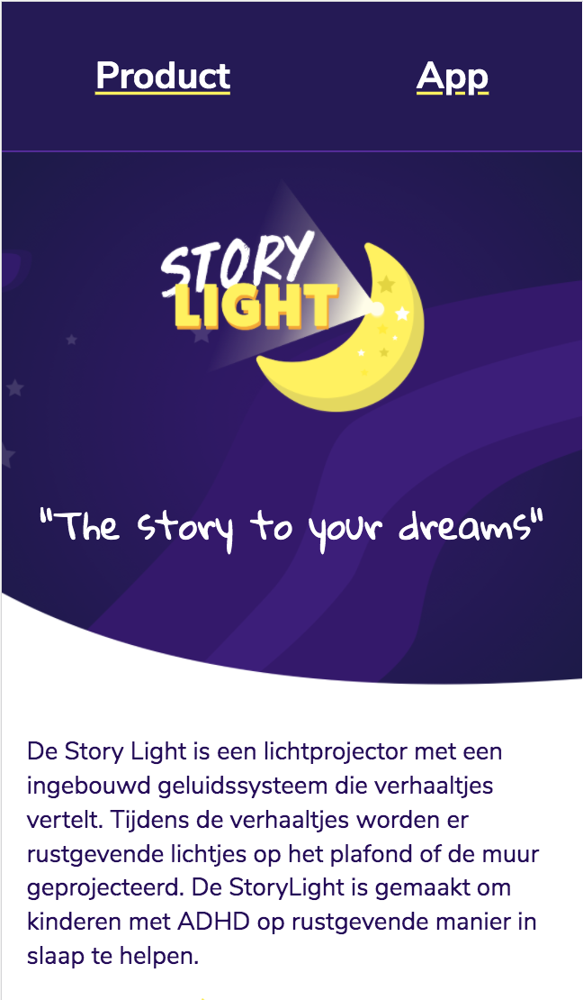
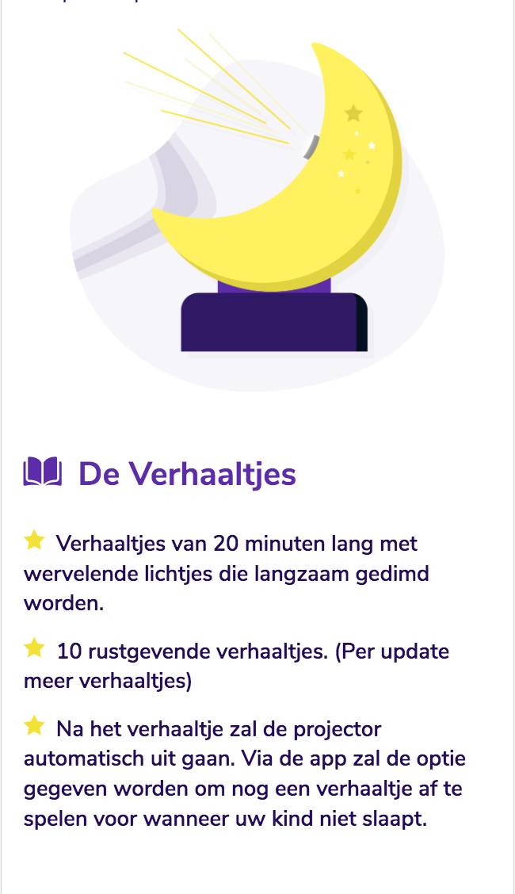
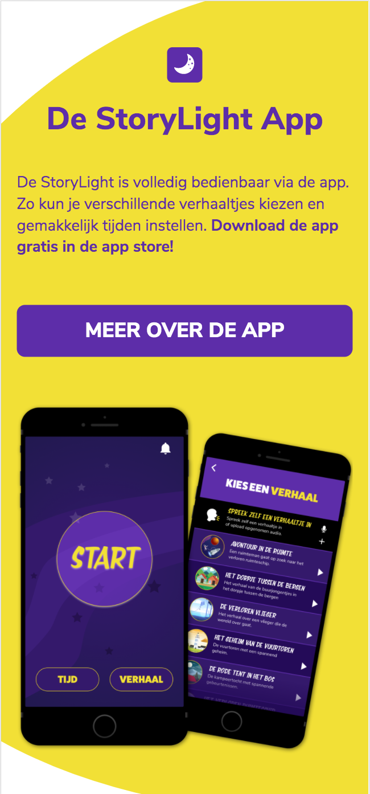
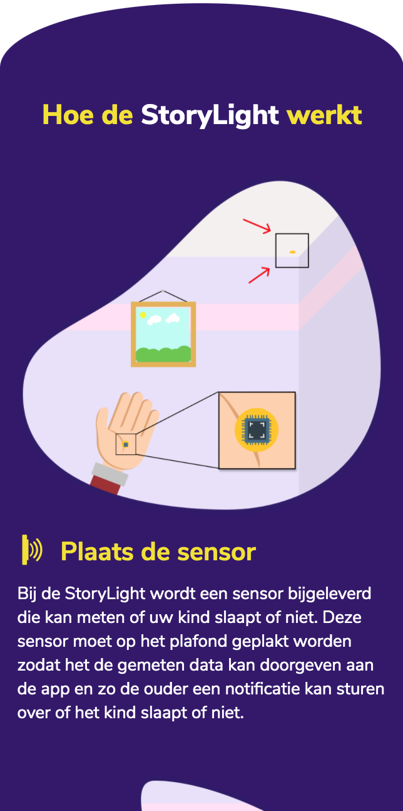
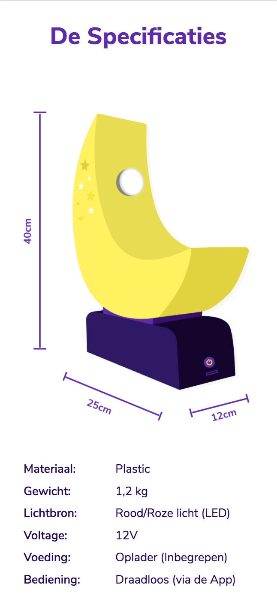

# Procesverslag
**Auteur:** Nino Schellingerhout

**Link naar mijn CodePen:** https://codepen.io/nino-schellingerhout/pens/forked

## Bronnenlijst
1. -bron 1-
2. -bron 2-
3. -...-

## Eindgesprek (week 7/8)

-dit ging goed & dit was lastig-

**Screenshot(s):**

-screenshot(s) van je eindresultaat-

## Voortgang 3 (week 6)

-same as voortgang 1-

## Voortgang 2 (week 5)

-same as voortgang 1-

## Voortgang 1 (week 3)

### Stand van zaken

Over het algemeen ging het beter dan verwacht. In het begin was het wel weer even wennen om alles correct op te bouwen maar toen ik eenmaal weer de smaak te pakken had ging het goed!

**Wat erg goed ging:**
- Het opbouwen van een correcte HTML structuur.
- Het schrijven van CSS en het implementeren van de geleerde theorie.

**Wat nog wat lastiger was:**
- Het vooruit denken naar desktop, aangezien we nu vanuit mobiel moeten starten.
- Mijn website overzetten naar GitHub ging nogal moeizaam, de afbeeldingen laden niet allemaal.

**Screenshot(s):**

### Agenda voor meeting

Vragen:
- Hoe kan ik correct mijn gebruikte afbeeldingen linken zodat ze in GitHub worden vertoond?

### Verslag van meeting

## Intake (week 1)

**Je startniveau:** Rood

**Je focus:** Responsive

**Je opdracht:** StoryLight ontwerp van Project Slaap

**Screenshot(s):**

**Breakdown-schets(en):**

