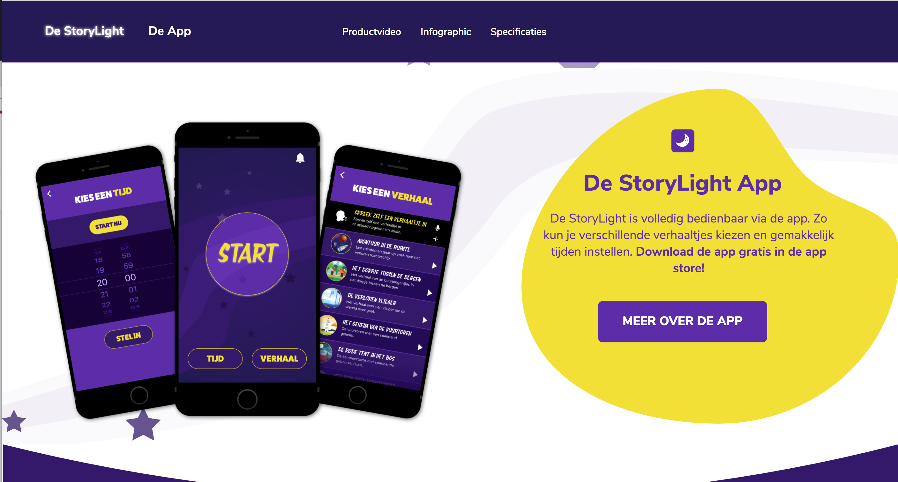

# Procesverslag
**Auteur:** Nino Schellingerhout

**Link naar mijn CodePen:** https://codepen.io/nino-schellingerhout/pens/forked

## Bronnenlijst
1. DLO/Codepen (Bovenaan staat een link naar mijn codepen)
2. CSS tricks: https://css-tricks.com/
3. Stackoverflow: https://stackoverflow.com/
4. Developer.mozilla.org: https://developer.mozilla.org/

## Eindgesprek (week 7/8)

Dit waren de 2 zwaarste weken van het blok. Ik was al erg ver voor de vakantie, alleen moest ik nog een volledige 2de pagina ontwerpen en bouwen.
Mijn ontwerp van de website was namelijk een one page en daarom was er nog geen ontwerp van de tweede pagina. Daarnaast moest ik mijn website ook nog responsive maken voor desktop waar nog veel extra werk bij kwam kijken.

Ten slotte moest ik ook nog een micro interactie verwerken met javascript. Mijn javascript skills zijn nog niet al te best, dus ik heb enorm veel zitten onderzoeken en testen. Ik heb als micro interactie gekozen voor een responsive menu (hamburger) gebaseerd op de opdrachten uit de lessen (JS oefening 2 & Mediaqueries oefening 3). Daarnaast wou ik eigenlijk ook nog een on-page navigatie die scrolt naar een bepaalde positie op de pagina. Aangezien dit niet in de lessen naar voren is gekomen heb ik dit zelf moeten uitzoeken. Ik heb hiervoor veel onderzoek gedaan naar verschillende methodes en ben uiteindelijk op een optie gekomen die voor mijn opdracht het beste werkte. Ik heb deze methode gevonden via Developer.mozilla.org.

**Wat erg goed ging:**
- De stap van Tablet naar Desktop heeft veel tijd gekost maar is wel goed gelukt, met dank aan flexbox!
- Het verwerken van de button states is nu ook een stuk duidelijker voor me en daarom ook goed gelukt.
- Het bouwen van de tweede pagina ging een stuk sneller dan de eerste, vooral omdat ik nu precies wist wat ik moest doen.

**Wat nog wat lastiger was:**
- Het verwerken van een microinteractie met javascript, het hamburger menu maken vond ik nog best wel lastig en heeft me veel tijd gekost om perfect te krijgen.
- De on-page navigatie was ook nog een hele klus, terwijl het in eerste instantie best wel makkelijk leek.

**Screenshot(s):**

Ontwerp product pagina:

## Voortgang 3 (week 6)

Net als vorige week ben ik bezig geweest met responsive design alleen nu voor desktop. Ik heb hiervoor het formaat 1200px genomen en ga hierna waarschijnlijk nog 1 formaat toevoegen. De stap van tablet naar desktop ging me toch iets moeilijker af dan de stap van mobiel naar tablet.
Dit kwam vooral omdat ik nu veel meer gebruik moet maken van flexbox en positioning.

**Wat erg goed ging:**
- Mijn Hero heb ik erg goed responsive kunnen krijgen doormiddel van een .svg en background-position, hier was ik erg blij mee.
- Door flexbox is het ook goed gelukt om van mijn 1 kolom secties 3 & 4 kolom secties te maken.

**Wat nog wat lastiger was:**
- Sommige achtergrond elementen heb ik als background-image opgebouwd, maar voor desktop werkt dit toch minder goed waardoor ik nu weer een stap terug moet nemen.

## Voortgang 2 (week 5)

Ik ben in deze periode meer gaan richten op het responsive maken van mijn website. Hierbij ben ik begonnen met de tablet vanaf 768px breed.
Over het algmeen ging dit best wel goed, wat ook voornamelijk kwam door de codepen lessen.

**Wat erg goed ging:**
- Het verkleinen en vergroten van bepaalde elementen zodat ze goed te zien zijn op zowel mobiel als tablet.
- Minimalistische CSS kunnen behouden, wat inhoud dat ik zo min mogelijk regels heb geschreven in mijn mediaqueries.

**Wat nog wat lastiger was:**
- Ik kwam erachter dat ik sommige secties verkeerd heb opgebouwd, er missen nu elementen om het volledig responsive te maken zoals in mijn ontwerp.
- Het vergroten van de font size heb ik iets teveel moeten aanduiden in mijn CSS, dit komt omdat ik nu voor het eerst met EM werk inplaats van px.

**Screenshot(s):**

## Voortgang 1 (week 3)

### Stand van zaken

Over het algemeen ging het beter dan verwacht. In het begin was het wel weer even wennen om alles correct op te bouwen maar toen ik eenmaal weer de smaak te pakken had ging het goed!

**Wat erg goed ging:**
- Het opbouwen van een correcte HTML structuur.
- Het schrijven van CSS en het implementeren van de geleerde theorie.

**Wat nog wat lastiger was:**
- Het vooruit denken naar desktop, aangezien we nu vanuit mobiel moeten starten.
- Mijn website overzetten naar GitHub ging nogal moeizaam, de afbeeldingen laden niet allemaal.

**Screenshot(s):**

### Agenda voor meeting

Vragen:
- Hoe kan ik correct mijn gebruikte afbeeldingen linken zodat ze in GitHub worden vertoond?

## Intake (week 1)

**Je startniveau:** Rood

**Je focus:** Responsive

**Je opdracht:** StoryLight ontwerp van Project Slaap

**Screenshot(s):**

**Breakdown-schets(en):**

